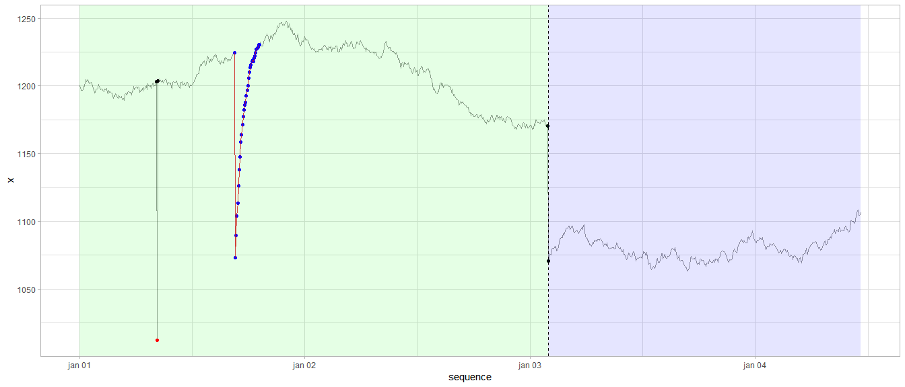

<!-- README.md is generated from README.Rmd. -->

# gwloggeR

`gwloggeR` is a R-package for automatic flagging of outliers and drifts
in raw air pressure data and outliers, level shifts and temporal changes
in raw hydrostatic pressure data. Here is a visual example of the
latter:

<!-- -->

Keep reading to learn how to start using `gwloggeR`.

## Installation

`gwloggeR` package is not available on CRAN, only on GitHub. The easiest
way to install it is to get the released binary with the following
command:

``` r
install.packages('https://github.com/DOV-Vlaanderen/groundwater-logger-validation/raw/master/gwloggeR/release/bin/win/gwloggeR_0.2.0.zip', repos = NULL)
```

For all released binaries, see the
[release](https://github.com/DOV-Vlaanderen/groundwater-logger-validation/tree/master/gwloggeR/release)
folder. More information about these releases one can find in the
[News](News.md) section.

More experienced users can install from source with the `devtools`
package and referring to the git repository holding the `gwloggeR`
source code:

``` r
devtools::install_github("DOV-Vlaanderen/groundwater-logger-validation", subdir = "gwloggeR", ref = "x.x.x")
```

Note the `ref = "x.x.x"` option. Replace it with the version you want to
install. Normally this will be the number of the latest stable release
as displayed in the top left corner of this page. By omitting the `ref`
option the latest development version will be installed.

## Usage

For general use, consult the [getting
started](https://dov-vlaanderen.github.io/groundwater-logger-validation/gwloggeR/docs/articles/gwloggeR.html)
tutorial.

For advanced understanding, consult the specific vignettes in the
Articles section.

## Development

Developers and maintainers of this package can find some general
guidelines in the [Development
guide](https://dov-vlaanderen.github.io/groundwater-logger-validation/gwloggeR/docs/articles/Development.html).
