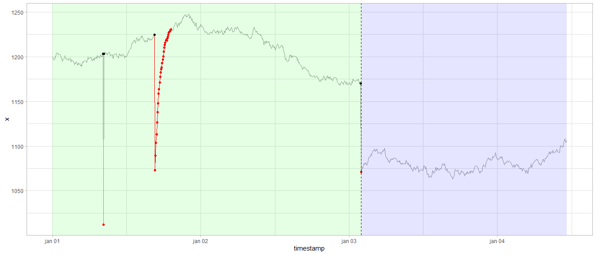

<!-- README.md is generated from README.Rmd. -->
gwloggeR
========

`gwloggeR` is a R-package for automatic flagging of outliers, levelshifts and temporal changes in raw airpressure and hydrostatic pressure data. For example.



Keep reading to learn how to start using `gwloggeR`.

Installation
------------

`gwloggeR` package is not available on CRAN, only on GitHub. The easiest way of installing the package is using the `devtools` package and referring to the git repository holding the package code:

``` r
devtools::install_github("DOV-Vlaanderen/groundwater-logger-validation", subdir = "gwloggeR", ref = "x.x.x")
```

Note the `ref = "x.x.x"` option. Replace it with the version you want to install. Normally this will be the number of the latest stable release as displayed in the top left corner of this page. Alternatively, one can also install previous releases documented in the [News](News.md) section. By omitting the `ref` option the devopment version will be installed.

Usage
-----

For general use, consult the [getting started](https://dov-vlaanderen.github.io/groundwater-logger-validation/gwloggeR/docs/articles/gwloggeR.html) tutorial.

For advanced understanding, consult the specific vignettes.

Development
-----------

Developers and maintainers of this package can find some general guidelines in the Development section.
